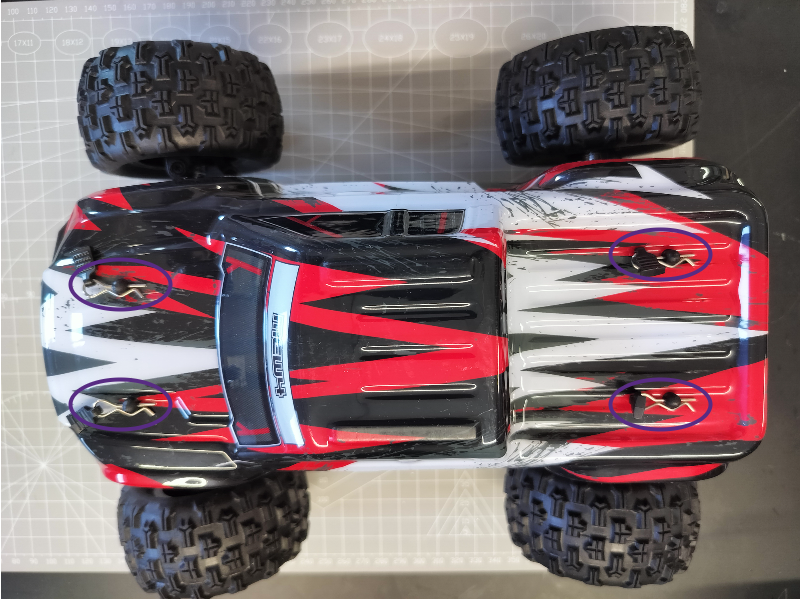
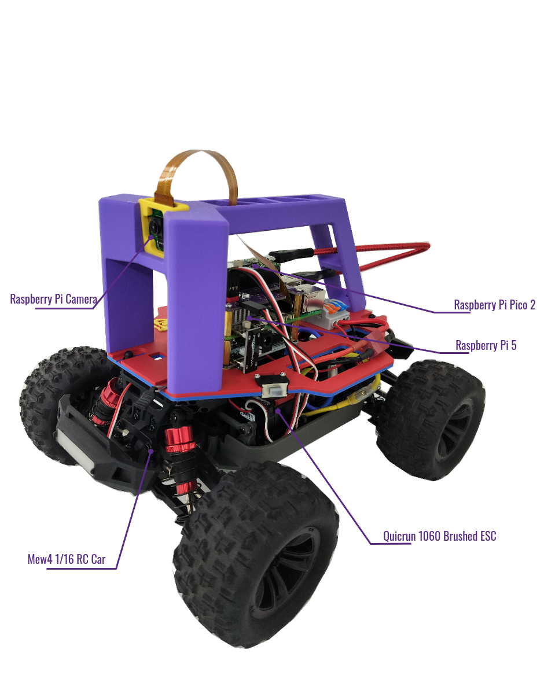

# Hardware Customization Guide

We recommend you to follow the orders below to assemble your BearCar

## 1 ESC Upgrade

The RC car comes with a receiver integrated ESC, which is not ideal for hacking the drivetrain (Thank to [DonkeyCar's FAQ](https://docs.donkeycar.com/support/faq/)).
Therefore, we need to put a microcontroller-friendly ESC on the board.

### 1.1 Body Cover Removal

Remove 4 body clipping pins as circled in the picture below.

### 1.2 Stock ESC Removal

- Disconnect and remove the battery.
- Unplug the motor wires (blue and yellow) on the ESC end.
- Unplug two sets of signal wires with Futaba connectors on the ESC 3x3 pin connector.
- Cut the zip-tie on the signal wires.
- Remove two screws locking the stock ESC.

The frame that embracing the steering servo motor will be revealed after removal of the stock ESC.

### 1.3 Quicrun ESC Installation

- You can simply tape the Quicrun ESC on top of the servo frame.
- Connect the motor wires (yellow and blue) to the new ESC (matching the color is recommended).
- It is recommended to mount the new ESC in direction as below picture shown.
- Set the driving mode to __F/R__ by removing the jumper cap on the top row of the 3x2 header pins.
- Notify the ESC that __LiPO__ battery will be used by placing the jumper cat on the bottom row of the 3x2 header pins.

## 2 Wire Splitter Assembly

The wire splitter splits the 2 input channel into 4 output channels.
The channels in same color are connected together.
We recommend you to plug positive wires to the orange channels, and negative wires to the blue channels.

- (Optional) Peel extra skin off the wires. Or the levers may bite the skins instead of the exposed metal (broken circuit).
- Insert wires with __male__ T-plug connector to the __input__ end.
- Insert wires with __female__ T-plug connector to the __output__ end.
- Insert wires with JST-XH connector to the __output__ end.

> __WARNING:__ Finger pinch hazard.

### 2.1 Pre-Assembled

### 2.2 Post-Assembled

## 3 Frame Bed Assembly

### 3.1 Splitter Assembly Installation

- 2xM2.5-12 screws and 2xM2.5 nuts.

### 3.2 RPi Power Expansion Board Installation

- 4xM2.5-15 standoffs
- (Optional) 4xM2.5 nuts, for under the bed secure.

### 3.3 Raspberry Pi 5 Installation

- 22-Pin to 15-Pin RPi camera cable.
- It is recommended to attach the camera cable at this step.
- Watch out camera cable's direction.

### 3.4 Pico Carrier Installation

- 4xM2.5-6 screws

## 4 Frame Handle Assembly

### 4.1 Handle Bed Assembly

- 3xM4-10 screws

### 4.2 Raspberry Pi Camera Assembly

- Watch out for camera cable's direction.

### 4.3 Camera Assembly Installation

## 5 Car-Frame Integration

### 5.1 Attach ESC switch

### 5.2 ESC and Servo Wiring

- White - Sig
- Red - VBEC
- Black - GND

### 5.3 Connect Power Wires

- Male T-plug to battery.
- Female T-plug to ESC.
- JST-XH to RPi power expansion board.

### 5.4 Finish Frame Assembly

- Fasten frame bed to car chassis.
- Connect Pico and Pi 5 using micro-USB cable.
- Connect battery.

