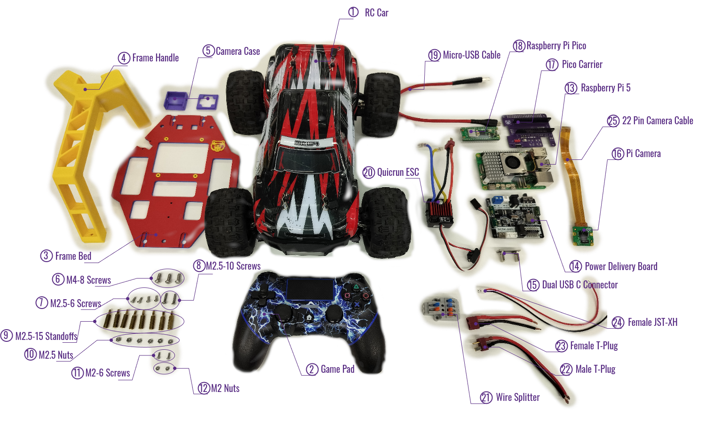

# Components List

## 1 On-Board Components

| Index | Item                             | Qty.   | Description | Link |
| :---: | :---                             | :---:  |  :--- | :--- |
| 1 | RC Car | 1 | 1:16, with brushed motor | [https://a.co/d/91ZDgie](https://a.co/d/91ZDgie) |
| 2 | Game Pad | 1 | Wired/Wireless, XBox/PS/generic | [https://a.co/d/iRLK60r](https://a.co/d/iRLK60r) |
| 3 | Frame Bed | 1 | 3D printable | [https://github.com/UCAEngineeringPhysics/bearcar_me](https://github.com/UCAEngineeringPhysics/bearcar_me) |
| 4 | Frame Handle | 1 | 3D printable | [https://github.com/UCAEngineeringPhysics/bearcar_me](https://github.com/UCAEngineeringPhysics/bearcar_me) |
| 5 | Camera Case | 1 | 3D printable | [https://www.printables.com/model/17917-raspberry-pi-camera-v2-3030-2020-mount](https://www.printables.com/model/17917-raspberry-pi-camera-v2-3030-2020-mount) |
| 6 | M4-8 Screw | 3 | Secure frame handle on bed |  |
| 7 | M2.5-6 Screw | 4 | Secure Pico carrier board |  |
| 8 | M2.5-10 Screw | 2 | Secure wire splitter |  |
| 9 | M2.5-15 Standoff | 8 | Support RPi5 and Pico carrier board |  |
| 10 | M2.5 Nut | 6 | Secure boards and wire splitter |  |
| 11 | M2 Screw | 2 | Secure ESC switch |  |
| 12 | M2 Nut | 2 | Secure ESC switch |  |
| 13 | Raspberry Pi 5 | 1 | Brain of the robot, 2.4GHz quad-core CPU | [https://www.pishop.us/product/raspberry-pi-5-4gb/](https://www.pishop.us/product/raspberry-pi-5-4gb/) |
| 14 | RPi5 Power Expansion Board | 1 | Delivers 5V5A via PD protocol | [https://category.yahboom.net/collections/a-power/products/power-board-pi5](https://category.yahboom.net/collections/a-power/products/power-board-pi5) |
| 15 | Dual USB-C Connector Board | 1 | Delivers power from power expansion board to RPi5 | [https://category.yahboom.net/collections/a-power/products/power-board-pi5](https://category.yahboom.net/collections/a-power/products/power-board-pi5) |
| 16 | Raspberry Pi Camera | 1 | Eye of the robot, 11.9 MP  | [https://www.pishop.us/product/raspberry-pi-camera-module-3/](https://www.pishop.us/product/raspberry-pi-camera-module-3/) |
| 17 | Pico Carrier Board | 1 | Interface for Pico | [https://github.com/UCAEngineeringPhysics/bearcar_ee](https://github.com/UCAEngineeringPhysics/bearcar_ee) |
| 18 | Raspberry Pi Pico 2W | 1 | Cerebellum of the robot, RP2350 microcontroller | [https://www.pishop.us/product/raspberry-pi-pico-2w-with-header/](https://www.pishop.us/product/raspberry-pi-pico-2w-with-header/) |
| 19 | Micro-USB Cable | 1 | Transfer data between Pico and RPi5 |  |
| 20 | Quicrun 1060 brushed ESC | 1 | Motor speed regulator, provides power to steering servo | [https://a.co/d/9Cwsu1n](https://a.co/d/9Cwsu1n) |
| 21 | Wire Splitter | 1 | Split input battery power to feed ESC and computers | [https://a.co/d/1j4jFMG](https://a.co/d/1j4jFMG) |
| 22 | Wired Male T-Plug Connector | 1 | Splitter input, 16 AWG wire, length >= 65 mm | [https://a.co/d/3CwSQNg](https://a.co/d/3CwSQNg) |
| 23 | Wired Female T-Plug Connector | 1 | Splitter output to ESC, 16 AWG wire, length >= 50 mm | [https://a.co/d/3CwSQNg](https://a.co/d/3CwSQNg) |
| 24 | Wired JST-XH connector | 1 | Splitter output to power expansion board | [https://a.co/d/eqwb7Dw](https://a.co/d/eqwb7Dw) |
| 25 | Pi Camera Cable | 1 | 22-Pin to 15-pin | [https://a.co/d/0rL2ziT](https://a.co/d/0rL2ziT) |

## 2 Raspberry Pi Peripherals
>
> (To be continued)

## 3 Handy Tools
>
> (To be continued)
