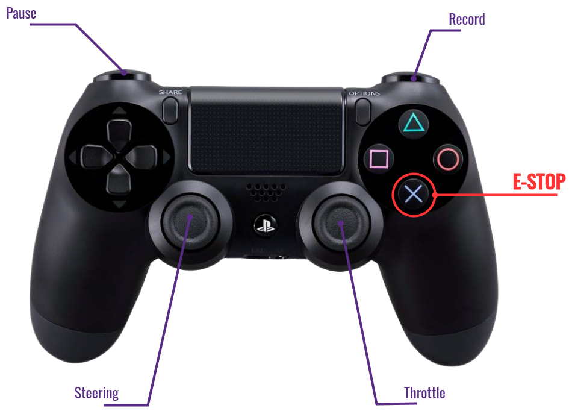

# Gamepad Keymap

If you are using a Play Station like gamepad, the default keymap should be the same as shown in the image.

Otherwise, find index of interested buttons and joy axes using `tests/gamepad.py`

## Bluetooth Connection

> (To be continued...)
