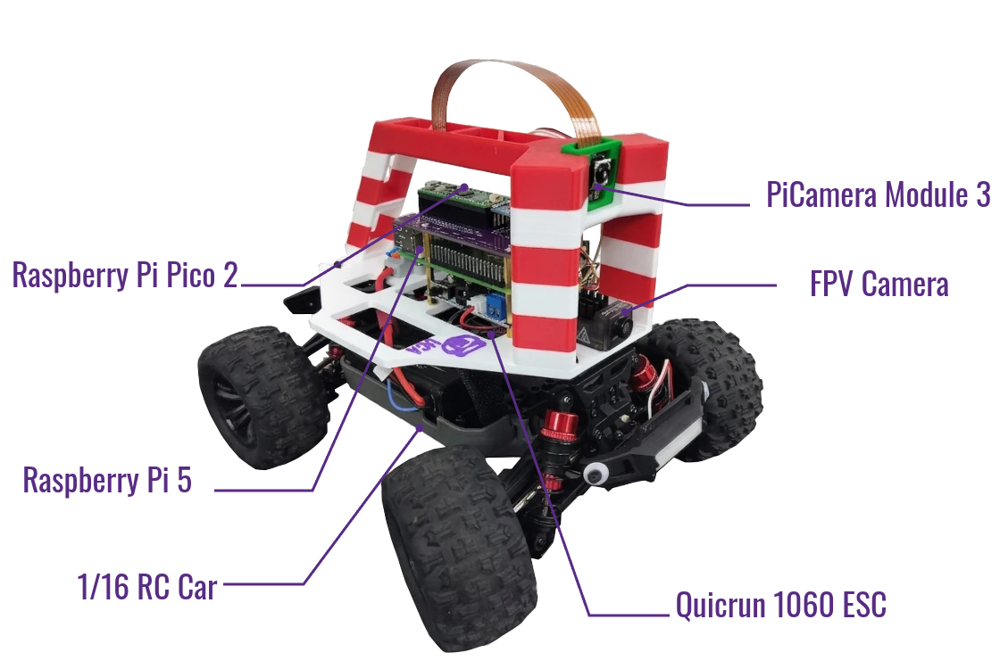

# Meet BearCar

**BearCar** is an open-source self-driving platform.
It is designed for educational purposes with emphases on robotics, and autonomous driving powered by AI (behavioral-cloning).
It customizes an off-the-shelf toy RC car into a full autonomous driving robot.
It features Raspberry Pi family products, including a **Raspberry Pi (5)** computer making plans, and a **Raspberry Pi Pico (2)** microcontroller executing the plans.
All the software is developed in Python.

## Key Specifications

| Features | Details |
| :--- | :--- |
| **Size** | 1:16 |
| **Microcontroller** | Raspberry Pi Pico 2 (RP2350) |
| **MicroPython Firmware** | 1.28.0 |
| **Computer** | Raspberry Pi 5 (4GB) |
| **Operating System** | Raspberry Pi OS (trixie) |

## Resources

- Mechanical design: [https://github.com/ucaengineeringphysics/bearcar_me](https://github.com/ucaengineeringphysics/bearcar_me.git)
- Electrical design: [https://github.com/ucaengineeringphysics/bearcar_ee](https://github.com/ucaengineeringphysics/bearcar_ee.git)
- Microcontroller software: [https://github.com/ucaengineeringphysics/bearcar_pico](https://github.com/ucaengineeringphysics/bearcar_pico.git)
- Computer software: [https://github.com/ucaengineeringphysics/BearCar](https://github.com/ucaengineeringphysics/BearCar.git)
- Documentation (this site): [https://github.com/ucaengineeringphysics/bearcar_docs](https://github.com/ucaengineeringphysics/bearcar_docs.git)
