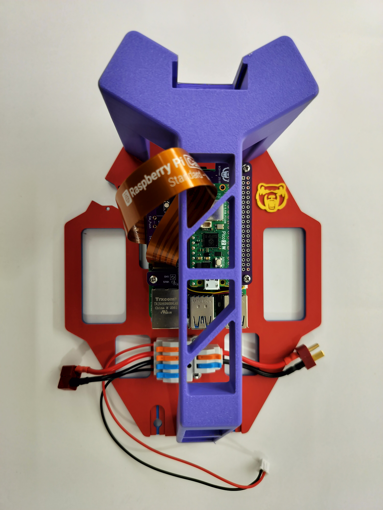

# Assembling Guide

!!! tip
    It is recommended to follow the order of the steps below.

## 1 ESC Upgrade

The RC car comes with a receiver integrated ESC, which is not ideal for hacking the drivetrain (Thank to [DonkeyCar's FAQ](https://docs.donkeycar.com/support/faq/)).
Therefore, we need to put a microcontroller-friendly ESC on the board.

### 1.1 Remove Stock Cover

Expose the components under the hood by removing the clips as shown below.

### 1.2 Remove Stock ESC

- Disconnect and remove the battery.
- Unplug the motor wires (blue and yellow).
!!! warning
    Unplug motor wires **on the ESC**.
- Unplug two sets of signal wires with Futaba connectors on the ESC 3x3 pin connector.
- Cut the zip-tie on the signal wires.
- Remove two screws locking the stock ESC.

???+ tip
    The bracket that embracing the servo motor will be revealed after the removal of the stock ESC.

### 1.3 Quicrun 1060 Brushed ESC Installation

- Set the driving mode to **F/R** by removing the jumper cap on the top row of the 3x2 header pins.
- Notify the ESC that **LiPO** battery will be used by placing the jumper hat on the bottom row of the 3x2 header pins.
- Connect the motor wires (yellow and blue) to the new ESC (matching the color is recommended).
!!! success
    It is recommended to mount the new ESC in direction as below picture shown.
- Mount upgraded ESC on top of the servo bracket.
!!! tip
    You can simply tape the ESC.

## 2 Assemble Power Distributor

The core of the power distributor is a 2-input, 6-output wire splitter.
The wires in the same color are connected together.

### 2.1 Prepare
- 1x 2-in, 6-out wire splitter.
- 1x Male T-Plug wires (input).
- 1x Female T-Plug wires (output).
- 1x Male JST-XH wires (output).
- 1x Female JST-RCY wires (output).

???+ tip
    Peel extra skin off the wires. 
    Or the levers may bite the skins instead of the exposed metal (broken circuit).

### 2.2 Assemble
!!! success
    It is highly recommended to plug positive wires to the orange channels, and negative wires to the blue channels.

!!! danger
    Finger pinch hazard.

### 2.3 Attach to the bed
!!! success
    Need 2x M2.5x12mm screws and 2x M2.5 nuts

## 3 Stack Control Tower

### 3.1 Prepare
- 4x M2.5 nuts
- 4x M2.5x6mm screws
- 4x M2.5x6mm+6mm standoffs
- 8x M2.5x16mm+6mm standoffs
- 1x Yahboom power expansion board
- 1x Raspberry Pi 5
- 1x BearCar relay board
- 1x Raspberry Pi Camera Module 3
- 1x Raspberry Pi Pico 2
- 1x GY-521 MPU6050 IMU breakout board

### 3.2 Set foundation
!!! success
    Need 4x M2.5x6mm+6mm standoffs and 4x M2.5 nuts

### 3.3 Stack power expansion board
!!! success
    Need 1x Yahboom power expansion board and 4x M2.5x16mm+6mm standoffs.

### 3.4 Stack Raspberry Pi
!!! success
    Need 1x Raspberry Pi 5 and 4x M2.5x16mm+6mm standoffs.

### 3.5 Insert Pi camera
!!! success
    Need 1x Raspberry Pi Camera Module 3

### 3.6 Stack relay board
!!! success
    Need 1x BearCar relay board and 4x M2.5x16mm+6mm standoffs.

### 3.7 Stack Pico and IMU
!!! success
    Need 1x Raspberry Pi Pico 2, 1x GY-521 MPU6050 breakout board and 4x M2.5x6mm screws.

## 4 Frame Handle Assembly

### 4.1 Handle Bed Assembly

- 3xM4-10 screws

### 4.2 Raspberry Pi Camera Assembly

- Watch out for camera cable's direction.

### 4.3 Camera Assembly Installation

## 5 Car-Frame Integration

### 5.1 Attach ESC switch

### 5.2 ESC and Servo Wiring

- White - Sig
- Red - VBEC
- Black - GND

### 5.3 Connect Power Wires

- Male T-plug to battery.
- Female T-plug to ESC.
- JST-XH to RPi power expansion board.

### 5.4 Finish Frame Assembly

- Fasten frame bed to car chassis.
- Connect Pico and Pi 5 using micro-USB cable.
- Connect battery.

