# Assembling Guide

!!! tip
    It is recommended to follow the order of the steps below.

## 1 ESC Upgrade

The RC car comes with a receiver integrated ESC, which is not ideal for hacking the drivetrain (Thank to [DonkeyCar's FAQ](https://docs.donkeycar.com/support/faq/)).
Therefore, we need to put a microcontroller-friendly ESC on the board.

### 1.1 Remove Stock Cover

Expose the components under the hood by removing the clips as shown below.

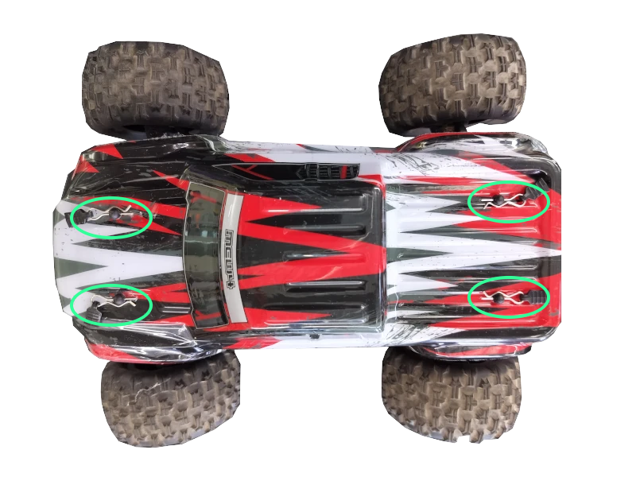

### 1.2 Remove Stock ESC

- Disconnect and remove the battery.
- Unplug the (blue and yellow) motor power wires (**on the ESC**) .
- Unplug two sets of PWM signal wires with Futaba connectors on the ESC 3x3 pin connector.
- Cut the zip-tie on the signal wires.
- Remove two screws locking the stock ESC.

???+ tip
    Servo motor is underneath the ESC.

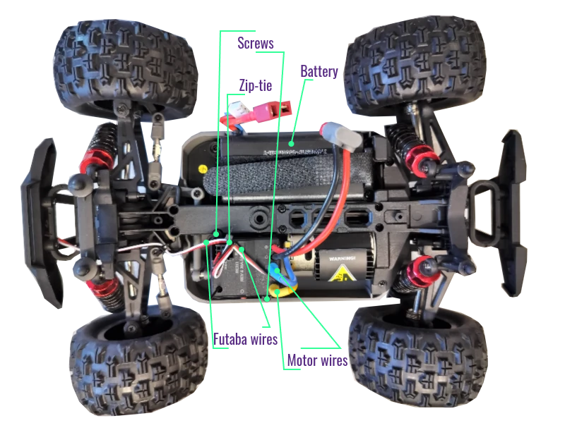

### 1.3 Replace (Quicrun 1060 Brushed) ESC

- Set the driving mode to **F/R** by removing the jumper cap on the top row of the 3x2 header pins.
- Notify the ESC that **LiPO** battery will be used by placing the jumper hat on the bottom row of the 3x2 header pins.
- Connect the motor wires (yellow and blue) to the new ESC (matching the color is recommended).
- Mount (tape) the new ESC on top of the servo motor.
!!! success
    It is recommended to mount the new ESC as shown below.
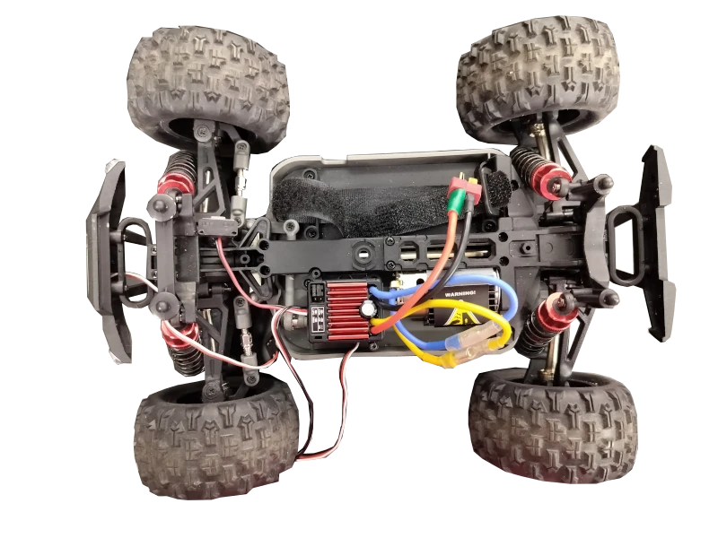

## 2 Assemble Power Distributor

The power distributor is a 2-input, 6-output wire splitter.
The wires in the same color are connected together (orange to orange, blue to blue).

### 2.1 Prepare

- 1x 2-in, 6-out wire splitter.
- 1x Male T-Plug wires (input).
- 1x Female T-Plug wires (output).
- 1x Male JST-XH wires (output).
- 1x Female JST-RCY wires (output).

!!! success
    Peel extra skin off the wires.
    Or the levers may bite the skins instead of the exposed metal (broken circuit).

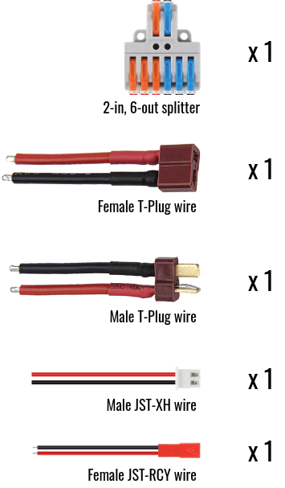

### 2.2 Assemble

!!! danger
    Finger pinch hazard.

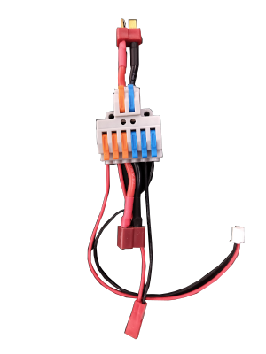

### 2.3 Attach to the bed

!!! note
    Need 2x M2.5x12mm screws and 2x M2.5 nuts

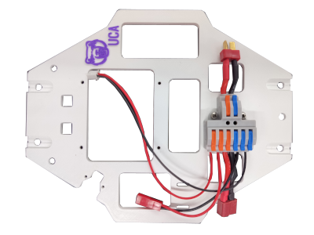

## 3 Stack Control Tower

### 3.1 Prepare

#### 3.1.1 Fasteners
- 4x M2.5 nuts
- 4x M2.5x6mm screws
- 4x M2.5x6mm+6mm standoffs
- 8x M2.5x16mm+6mm standoffs

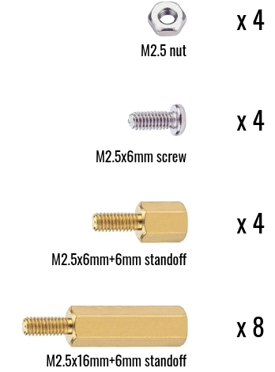
#### 3.1.2 Electronics
- 1x Yahboom power expansion board
- 1x Raspberry Pi 5
- 1x BearCar relay board
- 1x Raspberry Pi Camera Module 3
- 1x Raspberry Pi Pico 2
- 1x GY-521 MPU6050 IMU breakout board

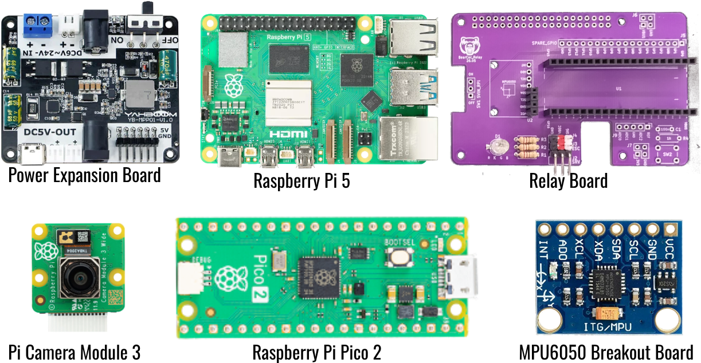

### 3.2 Set foundation

!!! note
    Need 4x M2.5x6mm+6mm standoffs and 4x M2.5 nuts

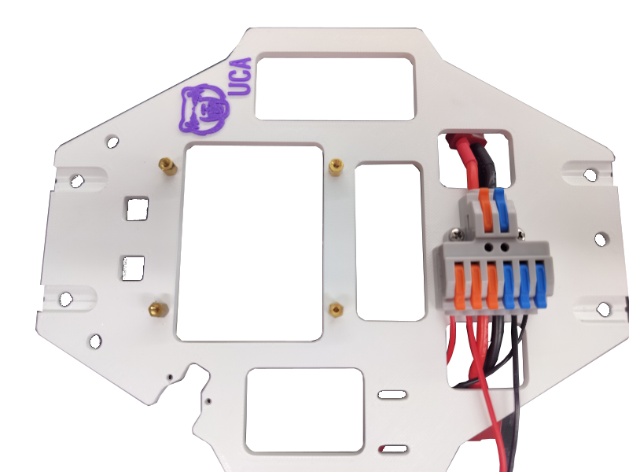

### 3.3 Stack power expansion board

!!! note
    Need 1x Yahboom power expansion board and 4x M2.5x16mm+6mm standoffs.

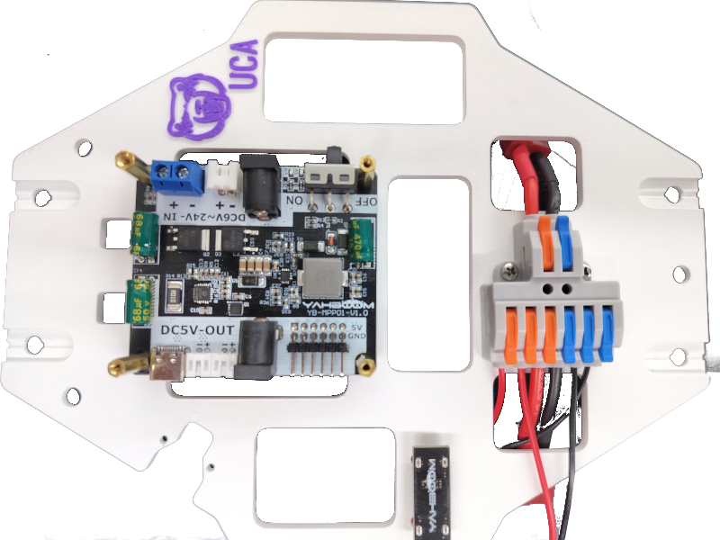

### 3.4 Stack Raspberry Pi

!!! note
    Need 1x Raspberry Pi 5 and 4x M2.5x16mm+6mm standoffs.

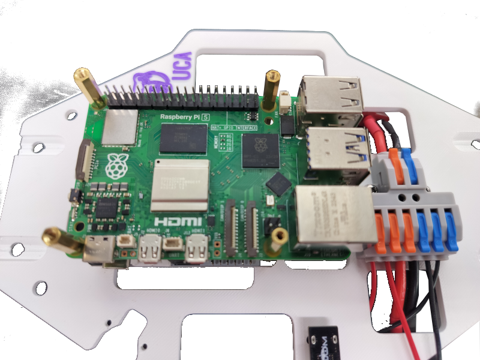

### 3.5 Insert Pi camera

!!! note
    Need 1x Raspberry Pi Camera Module 3

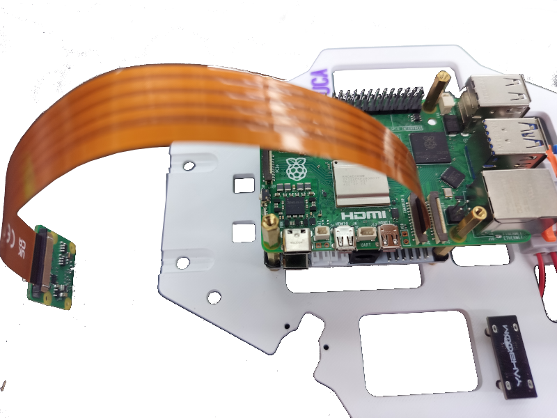

### 3.6 Stack relay board

!!! note
    Need 1x BearCar relay board and 4x M2.5x16mm+6mm standoffs.

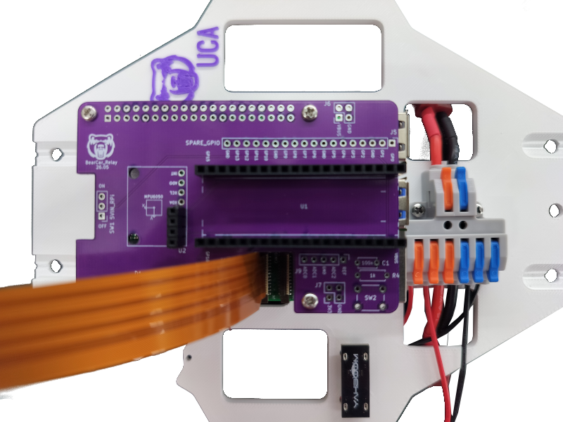

### 3.7 Stack Pico and IMU

!!! note
    Need 1x Raspberry Pi Pico 2, 1x GY-521 MPU6050 breakout board and 4x M2.5x6mm screws.

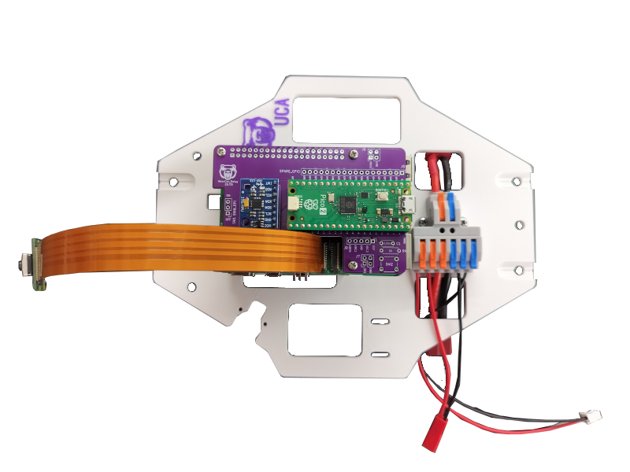

## 4 Assemble (Handled) Shield

### 4.1 Put camera in case

!!! warning
    Careful with camera cable's facing.

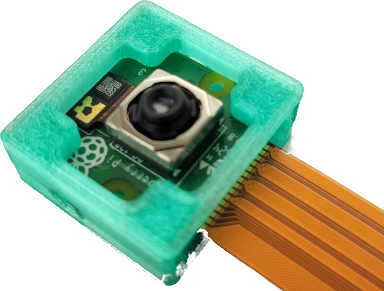

### 4.2 Assemble handle

!!! note
    Need 3x M4x16mm screws.

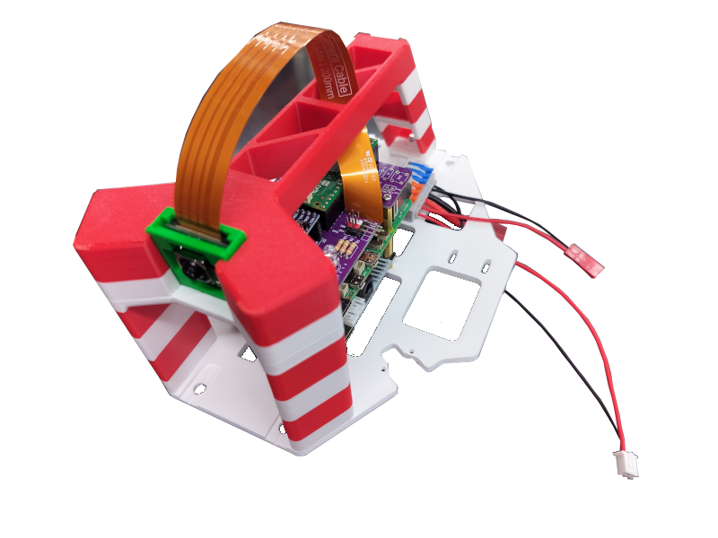

## 5 Car-Shield Integration

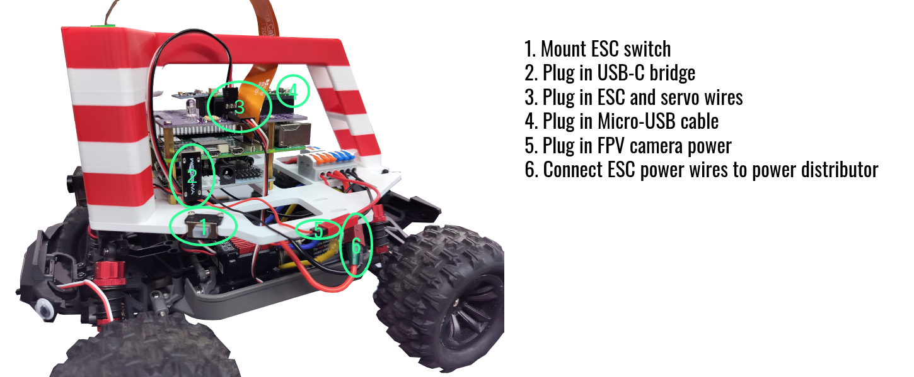

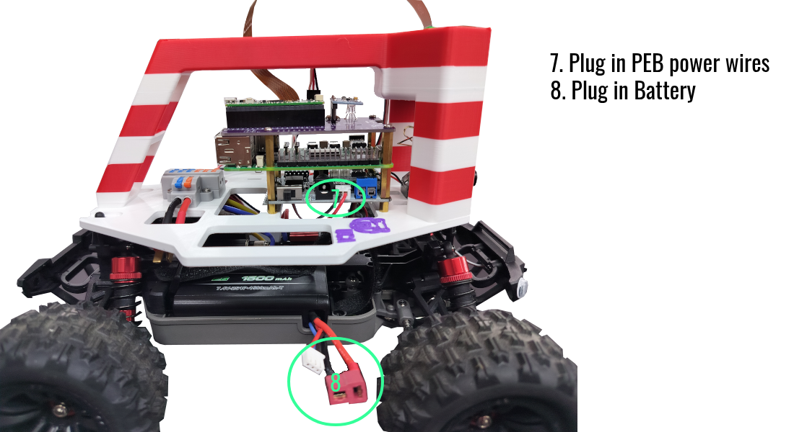

!!! note "ESC and Servo Wiring"
    - White - Sig
    - Red - +6V
    - Black - GND

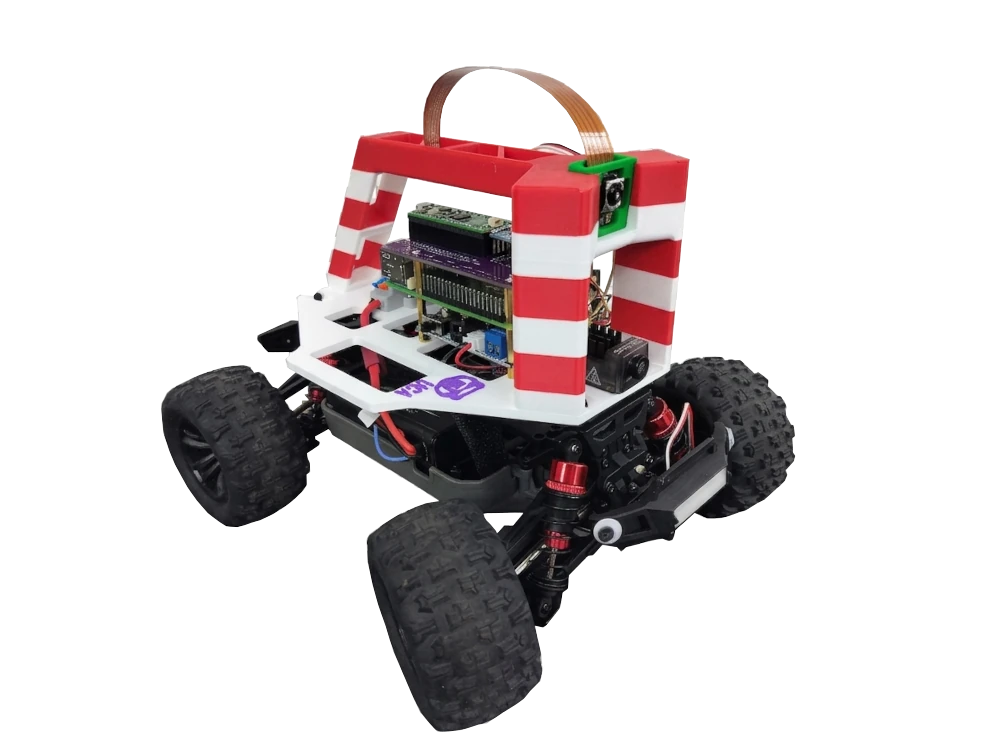
