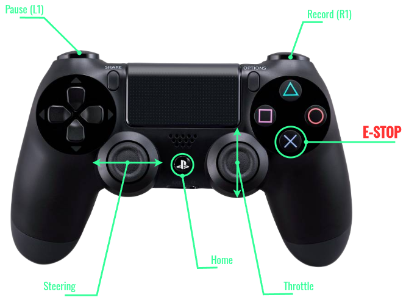
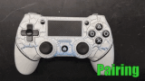
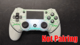
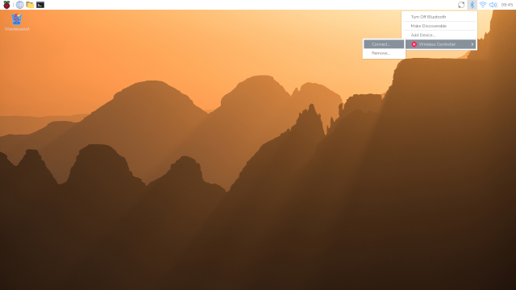
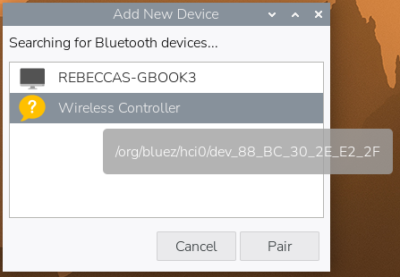

# Gamepad Usage Guide

## 1 Key Map

If you are using a Play Station like gamepad, the default key map should be the same as shown blow.



Otherwise, you can find indices of interested buttons and joystick axes using a test scripts:

```console
cd ~/BearCar/scripts/tests  # navigate to right location
uv run gamepad.py
```

## 2 Bluetooth Pairing

### 2.1 Activate Pariing Mode

On gamepad, press and **hold** the `HOME` and the `SHARE` button together, until the gamepads's LED starting to make **double blink** pattern (bluetooth pairing mode).

!!! warning
    If the user release the `SHARE` button too quick or only pressed down the `HOME` button, the LED will make single blinks and the user will not be able to view/connect the gamepad.
    Wait for the single blinking to be stopped by itself, then try again by pressing and **holding** down the `HOME` and the `SHARE` button together.




### 2.2 Connect Bluetooth Device

If the bluetooth device has been paired and connected to the RPi, it will be shown in the list.
Simply click the `bluetooth` icon (top right) :arrow_right: "`device name`" :arrow_right: `Connect...`



For the first time users, click the `bluetooth` icon (top right) :arrow_right: "`Add Device...`", the following window will pop out.



Choose the right device (Wireless Controller) to pair.

The LED on the gamepad will be stayed on after connection established successfully.

## 3 Connection via Command Line

There are chances your RPi is running in the headless mode (no monitor attached).
And you can connect to a bluetooth device through the command line tool: `bluetoothctl`

### 3.1 Remote Log In

In a terminal window on Host Machine, use `ssh` to log into RPi.

``` sh
ssh <username>@<ip_address>
```

### 3.2 Start Pairing

press and **hold** down the `HOME` and the `SHARE` button together, until the gamepads's LED starting to make **double blinks** pattern.

### 3.3 `bluetoothctl` Usage

1. In the remote terminal type: `bluetoothctl`. You'll notice the command prompt changed to `[bluetooth]#`.
2. Enter `scan on` to start discovering all the bluetooth devices nearby.
3. The gamepad ready for pairing should be listed as `[NEW] Device <MAC_address> Wireless Controller`.
4. Enter `pair <MAC_address>` to pair and auto connect to the bluetooth gamepad (You can use `tab` to autocomplete the `<MAC_address>`).
5. Enter `exit` or simply press `Ctrl+d` to quit `bluetoothctl` interface.
