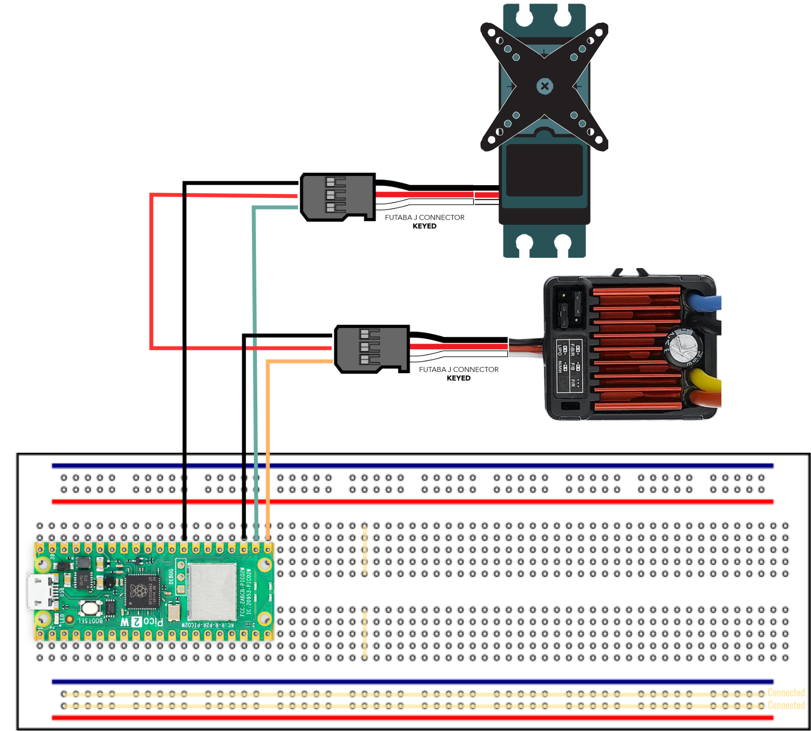
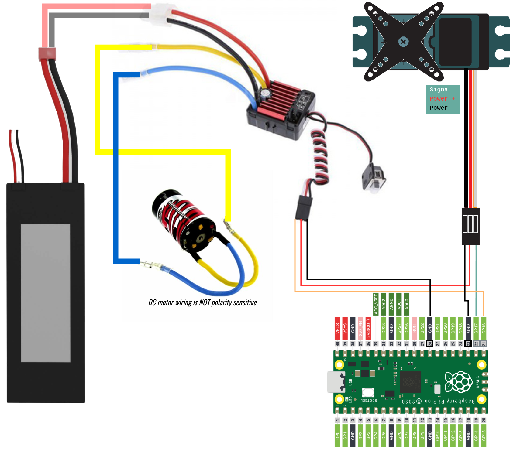
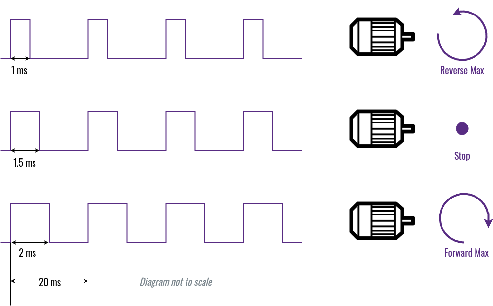
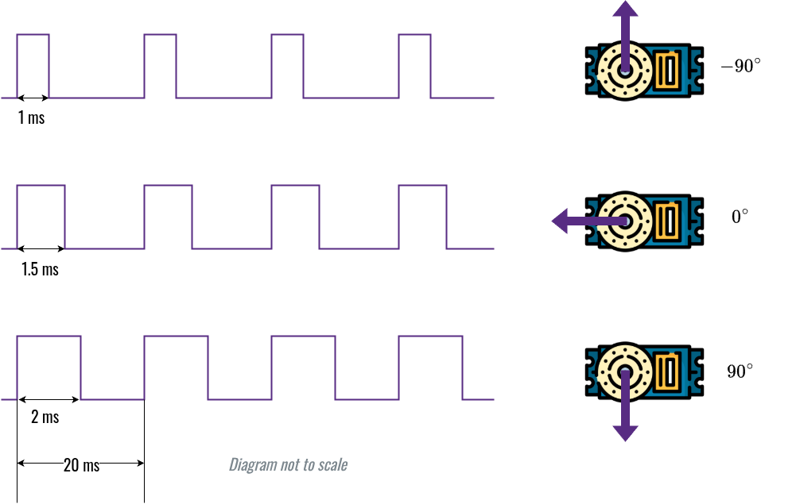

# Wiring Diagrams

## Breadboard Experiment with Pico, ESC and Servo

For electronics beginners, we highly recommend to set up the circuit on a breadboard following the diagram below.
> __Note:__ this is just the signal paths.

## Drivetrain Wiring

Connect the battery to ESC, so that the Pico board can order it (ESC) to squeeze some juice and spin the motors.

## Explain the Drivetrain

- The ESC (Electronic Speed Controller) governs the main engine motor's speed.
And thus, it determines how fast the BearCar can go.
- The servo motor (underneath ESC) has a position feedback circuit built-in.
Hence, it determines the steering angle of the BearCar.
- The Quicrun 1060 Brushed ESC has a BEC (Battery Elimination Circuit).
It is capable of outputting 6V 3A electric energy.
It is used to power the steering servo, and thus eliminates the need for another battery.
- Neither Raspberry Pi 5 nor the Pico board is powerful enough to directly drive the motors (especially the main engine).
So, a battery pack like a LiPO battery is needed to satisfy the energy hungry motors.
- The Pico board uses 50Hz PWM (Pulse Width Modulation) signal to tell ESC how fast the main engine should run.

- The Pico board also uses 50Hz PWM signal to tell servo what angle it should spin to.

